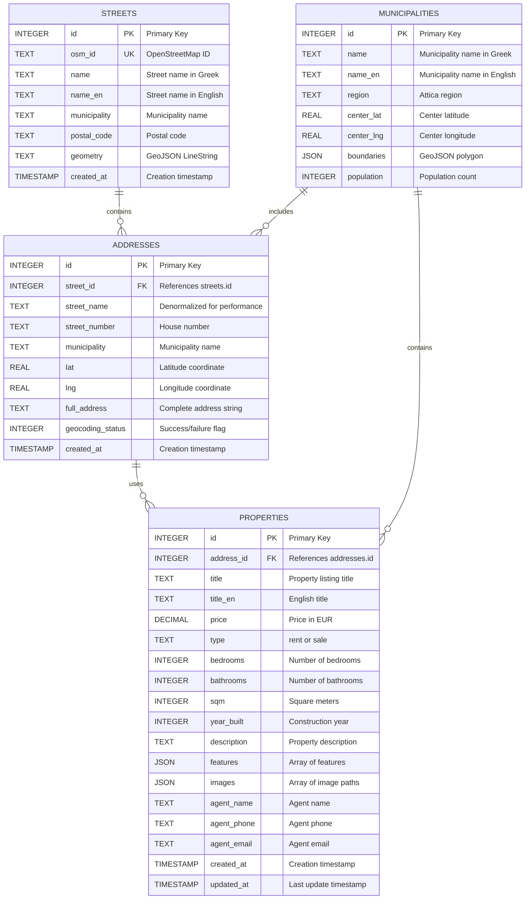

# Database Entity Relationship Diagram

## Overview
The Real Estate Athens database is built on SQLite and consists of 3 main tables that store geocoded address data from OpenStreetMap and generated property listings. The database design prioritizes performance through strategic indexing and normalization.

## Database Statistics
- **Total Size**: 37.27 MB
- **Streets**: 71,316 records (from OpenStreetMap)
- **Addresses**: 118,489 geocoded locations
- **Properties**: 1,000 generated listings
- **Municipalities**: 22 areas in Attica

## Entity Relationship Diagram



## Table Descriptions

### 1. STREETS Table
Stores street data imported from OpenStreetMap via Overpass API.

**Key Fields:**
- `id`: Auto-increment primary key
- `osm_id`: Unique OpenStreetMap identifier
- `name`: Street name in Greek (original)
- `name_en`: English transliteration
- `geometry`: GeoJSON LineString for street path
- `municipality`: Associated municipality (may be NULL)

**Indexes:**
- Primary key index on `id`
- Unique index on `osm_id`
- Text index on `name` for search

### 2. ADDRESSES Table
Contains geocoded address points along streets.

**Key Fields:**
- `id`: Auto-increment primary key
- `street_id`: Foreign key to streets table
- `lat`, `lng`: WGS84 coordinates from Nominatim
- `full_address`: Complete formatted address
- `municipality`: Assigned via proximity algorithm

**Indexes:**
- Primary key index on `id`
- Foreign key index on `street_id`
- Spatial composite index on `(lat, lng)`
- Text index on `street_name`
- Index on `municipality`

### 3. PROPERTIES Table
Generated property listings with realistic data.

**Key Fields:**
- `id`: Auto-increment primary key
- `address_id`: Foreign key to addresses table
- `price`: Calculated based on area averages
- `type`: Either 'rent' or 'sale'
- `features`: JSON array (e.g., ["Parking", "Balcony", "Storage"])
- `images`: JSON array of local image paths

**Indexes:**
- Primary key index on `id`
- Foreign key index on `address_id`
- Index on `type`
- Index on `price` for range queries
- Composite index on `(bedrooms, bathrooms)`

### 4. MUNICIPALITIES Table
Reference data for Attica municipalities.

**Key Fields:**
- `id`: Auto-increment primary key
- `name`: Official municipality name in Greek
- `boundaries`: GeoJSON polygon for area borders
- `center_lat`, `center_lng`: Geographic center

## Relationships

### One-to-Many Relationships
1. **STREETS → ADDRESSES**
   - One street contains multiple address points
   - Cascade: DELETE CASCADE (removing street removes addresses)

2. **MUNICIPALITIES → ADDRESSES**
   - One municipality contains many addresses
   - No cascade (reference only)

3. **MUNICIPALITIES → PROPERTIES**
   - One municipality contains many properties
   - No cascade (reference only)

### One-to-One Relationships
1. **ADDRESSES → PROPERTIES**
   - Each property has exactly one address
   - Not all addresses have properties (1000 out of 118,489)

## Performance Optimizations

### Indexing Strategy
```sql
-- Spatial queries
CREATE INDEX idx_addresses_coords ON addresses(lat, lng);

-- Text search
CREATE INDEX idx_addresses_street ON addresses(street_name);
CREATE INDEX idx_streets_name ON streets(name);

-- Filtering
CREATE INDEX idx_addresses_municipality ON addresses(municipality);
CREATE INDEX idx_properties_type ON properties(type);
CREATE INDEX idx_properties_price ON properties(price);

-- Foreign keys
CREATE INDEX idx_addresses_street_id ON addresses(street_id);
CREATE INDEX idx_properties_address_id ON properties(address_id);
```

### Query Optimization Examples
```sql
-- Find properties in a bounding box (uses spatial index)
SELECT p.*, a.lat, a.lng, a.full_address
FROM properties p
JOIN addresses a ON p.address_id = a.id
WHERE a.lat BETWEEN ? AND ?
  AND a.lng BETWEEN ? AND ?
  AND p.type = ?
ORDER BY p.price;

-- Search properties by street name (uses text index)
SELECT p.*, a.full_address
FROM properties p
JOIN addresses a ON p.address_id = a.id
WHERE a.street_name LIKE ?
LIMIT 50;
```

## Data Integrity Constraints

### Foreign Key Constraints
```sql
-- Addresses must reference valid streets
FOREIGN KEY (street_id) REFERENCES streets(id) ON DELETE CASCADE

-- Properties must reference valid addresses
FOREIGN KEY (address_id) REFERENCES addresses(id) ON DELETE CASCADE
```

### Check Constraints
```sql
-- Price must be positive
CHECK (price > 0)

-- Type must be valid
CHECK (type IN ('rent', 'sale'))

-- Coordinates must be valid
CHECK (lat BETWEEN 37.8 AND 38.2)  -- Attica bounds
CHECK (lng BETWEEN 23.4 AND 24.1)  -- Attica bounds

-- Square meters must be positive
CHECK (sqm > 0)

-- Bedrooms and bathrooms must be non-negative
CHECK (bedrooms >= 0)
CHECK (bathrooms >= 0)
```

## Database Creation Script

```sql
-- Create tables
CREATE TABLE IF NOT EXISTS streets (
    id INTEGER PRIMARY KEY AUTOINCREMENT,
    osm_id TEXT UNIQUE NOT NULL,
    name TEXT NOT NULL,
    name_en TEXT,
    municipality TEXT,
    postal_code TEXT,
    geometry TEXT,
    created_at TIMESTAMP DEFAULT CURRENT_TIMESTAMP
);

CREATE TABLE IF NOT EXISTS addresses (
    id INTEGER PRIMARY KEY AUTOINCREMENT,
    street_id INTEGER NOT NULL,
    street_name TEXT NOT NULL,
    street_number TEXT,
    municipality TEXT,
    lat REAL NOT NULL,
    lng REAL NOT NULL,
    full_address TEXT,
    geocoding_status INTEGER DEFAULT 1,
    created_at TIMESTAMP DEFAULT CURRENT_TIMESTAMP,
    FOREIGN KEY (street_id) REFERENCES streets(id) ON DELETE CASCADE,
    CHECK (lat BETWEEN 37.8 AND 38.2),
    CHECK (lng BETWEEN 23.4 AND 24.1)
);

CREATE TABLE IF NOT EXISTS properties (
    id INTEGER PRIMARY KEY AUTOINCREMENT,
    address_id INTEGER UNIQUE NOT NULL,
    title TEXT NOT NULL,
    title_en TEXT,
    price DECIMAL(10,2) NOT NULL,
    type TEXT NOT NULL,
    bedrooms INTEGER NOT NULL,
    bathrooms INTEGER NOT NULL,
    sqm INTEGER NOT NULL,
    year_built INTEGER,
    description TEXT,
    features TEXT, -- JSON array
    images TEXT,   -- JSON array
    agent_name TEXT,
    agent_phone TEXT,
    agent_email TEXT,
    created_at TIMESTAMP DEFAULT CURRENT_TIMESTAMP,
    updated_at TIMESTAMP DEFAULT CURRENT_TIMESTAMP,
    FOREIGN KEY (address_id) REFERENCES addresses(id) ON DELETE CASCADE,
    CHECK (price > 0),
    CHECK (type IN ('rent', 'sale')),
    CHECK (bedrooms >= 0),
    CHECK (bathrooms >= 0),
    CHECK (sqm > 0)
);

-- Create all indexes
CREATE INDEX idx_addresses_coords ON addresses(lat, lng);
CREATE INDEX idx_addresses_street ON addresses(street_name);
CREATE INDEX idx_addresses_municipality ON addresses(municipality);
CREATE INDEX idx_streets_name ON streets(name);
CREATE INDEX idx_properties_type ON properties(type);
CREATE INDEX idx_properties_price ON properties(price);
CREATE INDEX idx_properties_bedrooms_bathrooms ON properties(bedrooms, bathrooms);
```

## Data Pipeline Flow

```
OpenStreetMap (Overpass API)
         ↓
    71,316 Streets
         ↓
  Address Generation
  (10 per street avg)
         ↓
   Nominatim Geocoding
   (1 req/sec limit)
         ↓
  118,489 Addresses
         ↓
 Municipality Assignment
  (Proximity Algorithm)
         ↓
  Property Generation
  (Random selection)
         ↓
  1,000 Properties
```

## Future Enhancements

1. **Full-Text Search**
   - Add FTS5 virtual table for property descriptions
   - Enable Greek language stemming

2. **Spatial Extensions**
   - Integrate SpatiaLite for advanced GIS queries
   - Add R-tree indexes for polygon searches

3. **Time-Series Data**
   - Add price_history table for market trends
   - Track property view counts and favorites

4. **User-Generated Content**
   - Add reviews and ratings tables
   - Implement saved searches functionality